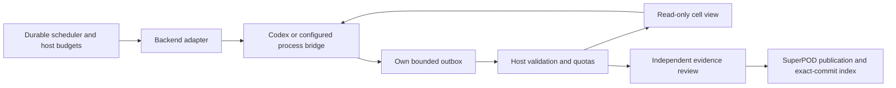

# Agent execution and shared communication

The controller separates durable scheduling, interchangeable execution backends,
and shared research proposals. The Rust entry points are `runtime`,
`agent_backend`, `multi_agent`, and `communication`. Bazel builds and tests these
modules together. The current production controller admits at most eight worker
processes; a logical topology containing 10,000 agents does not raise that limit.



## Execution adapters

Codex remains the default. Optional `agent_backends` definitions and
`role_backends` assignments select an adapter per role. A generic local process
bridge receives a versioned JSON request on stdin and writes a request-bound
result envelope. A coding-agent CLI or bot needs a wrapper implementing that
contract; merely configuring its name does not establish compatibility.

The host freezes executable/configuration bindings before execution and retains
the request digest outside the worker's writable directory. Results remain
untrusted until structural checks and workflow settlement complete. Capability
declarations cannot grant filesystem access or bypass leases, timeouts,
process-tree cancellation or independent evaluation. Generic backends receive
only explicitly selected credential environment variables and do not inherit
Codex authentication.

## A shared board without broadcast wakeups

Enable normal research communication with this optional configuration:

```toml
[multi_agent]
shared_research = true
```

This creates new frozen task identities. Historical tasks retain their original
configuration, prompt and replay semantics. Formal collaboration pilots and
holdouts do not opt into the board. Host-authored tasks may declare a
`communication` object with `id`, optional `cell`, `topics`, and `query`;
agent-generated follow-up text cannot assign itself a different team.

The host derives the actual cohort from the team/cell and frozen research inputs,
SuperPOD commit and configuration. Each attempt has one host-bound identity and
can write only its own outbox. Agents first develop their argument, then may share
findings, questions, counterexamples or references. A proposal is never an
instruction, verified finding, permission grant, task assignment or KB update.

The host polls a fixed number of numbered slots on a timer. It never scans an
arbitrary worker-created directory and never wakes, spawns or automatically
replies to a worker because of a message. Per-run, per-task and per-cohort quotas,
deduplication, expiry and reply-depth limits bound feedback loops. Failed or
unconfirmed senders are marked revoked; audit records remain but future selected
context excludes their proposals. A completed sender's claims still need review.

Every member can inspect its authorized cell's read-only view. Relevant initial
context is selected by host-frozen topic subscriptions/query, limited to four
messages and 4 KiB, with a digest retained in launch and completion evidence.
Empty subscriptions/query produce no automatic context. Direct worker reads of
the bounded view are possible: the 4 KiB selection limit is **not** a measured
limit on all tokens the model may read or generate.
The launch digest binds the initial selection, not proof that a model understood
it or a transcript of every later direct read. Later board views are mutable
caches of retained host authority; actual tool/read evidence remains separate.

```sh
agent-research-lab --config local.toml agents backends
agent-research-lab --config local.toml agents boards --shard 0 --limit 32
agent-research-lab --config local.toml agents view --cohort SHA256
```

List results are paginated by shard and cursor. Closing prevents new membership;
pruning requires a closed, expired cohort and retains identity tombstones. Archive
needed evidence before explicit `agents close` / `agents prune`; these operations
do not publish research to SuperPOD or reset message allowances.

## Growth to 1,000 and 10,000 logical agents

An all-to-all broadcast of one message per agent would require `N*(N-1)` directed
deliveries: 99,990,000 at 10,000 agents. The topology uses bounded cells, topic
indexes and pull-based summaries instead. A cell target of 32 agents gives 32
cells at 1,000 agents and 313 at 10,000; retry identities consume separate bounded
member records. Cells are routing partitions **within** a research authorization
scope. They must not bridge independent experiments, pilot arms or holdouts.

The filesystem board partitions host authority into 256 hash shards. Registration
uses a keyed run-ownership record rather than searching every other cohort.
Each shard has its own lock and bounded index; each poll touches a bounded cell
and a fixed number of slots. A noisy cell cannot grow a global queue or force
delivery to all subscribers. Capacity exhaustion is explicit and never discards
active records or silently resets quotas.
The quotas bound accepted host state and ingestion work; they do not impose a
filesystem quota on arbitrary worker-created log files. A larger executor pool
also needs independently tested CPU, memory, PID and disk limits.

The run ownership shard still reads and rewrites a bounded map (at most 4,096
records / 4 MiB); it is not an unbounded constant-time key-value database. Cohort
indexes retain at most 32 live cohorts and 4,096 known identities per shard.
Lifetime history therefore has explicit capacity limits. A larger or distributed
deployment needs an archival policy and a storage adapter with independent
recovery evidence; increasing counters alone is insufficient.

The scaling module models a separate summary exchange: host-admitted, bounded
summaries enter topic indexes; readers pull relevant entries under receiver and
global budgets. Fair scheduling, finite queues, deduplication and TTL provide
backpressure. Missing or slow consumers do not accumulate private copies of every
message. The exchange does not execute tasks or promote agent proposals to
SuperPOD. Important minority views and counterexamples can be included in reviewed
summaries; popularity is not a correctness score.

```sh
agent-research-lab --config local.toml agents simulate --agent-count 1000
agent-research-lab --config local.toml agents simulate --agent-count 10000
```

These are deterministic logical-load simulations of routing and resource bounds,
not 10,000 model calls or evidence of improved research quality. The current
runtime uses local bounded cell views; a distributed cross-cell summary service,
remote worker pool, consensus/leader failover, network partition handling and
provider-specific token admission remain separate extension work. Increasing
`max_agents` beyond eight is intentionally rejected until those executor and
budget controls have their own acceptance evidence.

Measure accepted/rejected/deferred messages, queue high-water marks, per-reader
bytes, duplicate suppression, fairness delay and work performed per tick. Measure
actual provider usage separately; logical message quotas are not exact billing
token limits. Any quality comparison also needs matched model/task budgets,
independent adjudication and retained dissent, failed reports and missing data.

Transient boards support an ongoing task. Reviewed durable findings, counter-
evidence and revised conclusions belong in SuperPOD. The host publishes them
serially, verifies the exact merged index, and supplies that version to the next
research round; the public project keeps concise reusable lessons only.
